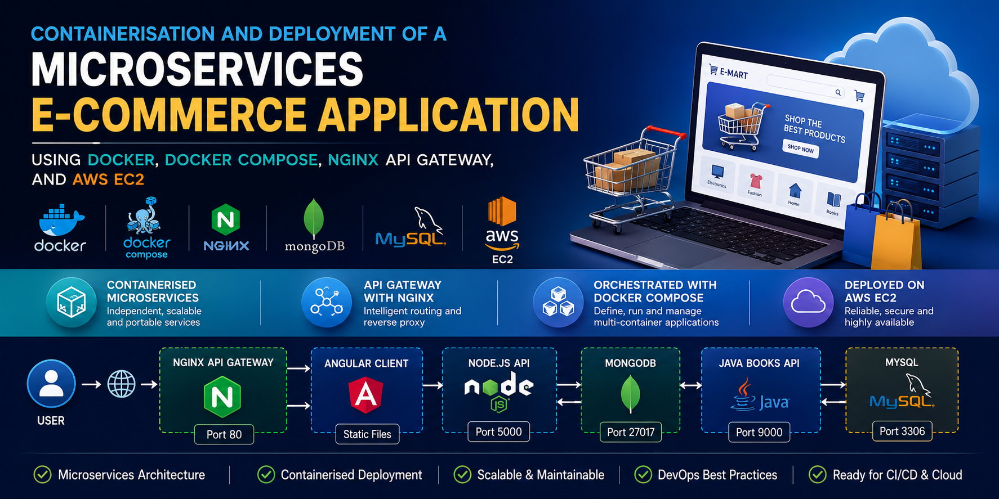
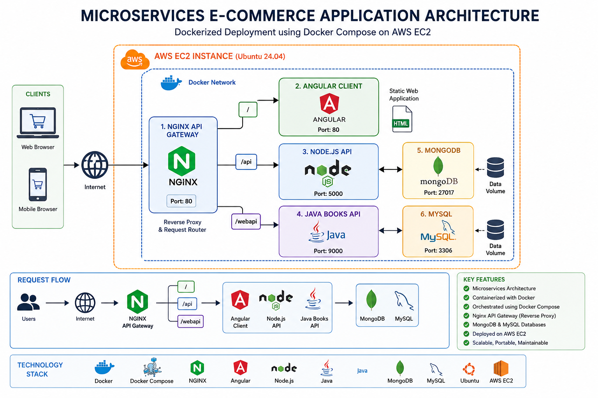

# Containerisation and Deployment of a Microservices E-Commerce Application Using Docker, Docker Compose, Nginx API Gateway, and AWS EC2



## Project Overview

This project demonstrates how to containerise and deploy a production-style microservices e-commerce application using **Docker**, **Docker Compose**, **Nginx API Gateway**, **MongoDB**, **MySQL**, and **AWS EC2**.

The application consists of multiple independent services packaged into Docker containers and orchestrated using Docker Compose. An Nginx API Gateway routes incoming requests to the appropriate backend services, while MongoDB and MySQL provide persistent data storage.

The project also demonstrates DevOps best practices including:

- Multi-stage Docker builds
- Container orchestration
- Reverse proxy configuration
- Service networking
- Cloud deployment on AWS EC2
- Docker image lifecycle management
- Incremental builds using Docker layer caching

---

# Architecture



---

# Technology Stack

| Category | Technologies |
|----------|--------------|
| Cloud | AWS EC2 |
| Containers | Docker, Docker Compose |
| API Gateway | Nginx |
| Frontend | Angular |
| Backend | Node.js |
| Backend | Java |
| Databases | MongoDB, MySQL |
| Build Tools | Maven, npm |
| Source Control | Git & GitHub |
| Operating System | Ubuntu Server 24.04 |

---

# Project Structure

```
E-mart-app/
│
├── client/
│   ├── Dockerfile
│   └── Angular source
│
├── nodeapi/
│   ├── Dockerfile
│   └── Node.js source
│
├── javaapi/
│   ├── Dockerfile
│   └── Java source
│
├── nginx/
│   └── default.conf
│
├── docker-compose.yml
│
└── README.md
```

---

# Microservices

## Angular Client

- Frontend application
- Built using Node.js
- Served using Nginx

---

## Node.js API

- REST API
- Connects to MongoDB
- Runs on Port **5000**

---

## Java Books API

- Java backend service
- Uses Maven
- Connects to MySQL
- Runs on Port **9000**

---

## Nginx API Gateway

Routes requests to backend services.

| Route | Destination |
|--------|-------------|
| `/` | Angular Client |
| `/api` | Node.js API |
| `/webapi` | Java Books API |

---

## Databases

### MongoDB

Used by the Node.js API.

### MySQL

Used by the Java Books API.

---

# Features

- Multi-container architecture
- Multi-stage Docker builds
- API Gateway routing
- Docker Compose orchestration
- AWS EC2 deployment
- MongoDB integration
- MySQL integration
- Production-style networking
- Docker layer caching
- Easy rebuild and redeployment

---

# Prerequisites

Before starting ensure you have:

- AWS Account
- Ubuntu EC2 Instance
- Git
- Docker Engine
- Docker Compose Plugin
- SSH Key Pair
- Visual Studio Code (optional)

---

# Deploying on AWS EC2

Detailed step-by-step deployment procedures, configuration details, and workflow documentation are available in the [Setup Guide](./Setup-Guide.md).

## 1. Launch EC2

Recommended configuration:

| Setting | Value |
|----------|-------|
| OS | Ubuntu 24.04 |
| Instance | t2.medium |
| Storage | 20 GB |
| Security Group | SSH (22), HTTP (80) |

---

## 2. Connect to EC2

```bash
ssh -i key.pem ubuntu@<PUBLIC-IP>
```

Become root.

```bash
sudo su -
```

---

## 3. Install Docker

Follow the official Docker Engine installation guide.

Verify installation:

```bash
systemctl status docker
```

---

## 4. Clone Repository

```bash
git clone https://github.com/OlumideOlumayegun/deployment-of-microservice-ecommerce-app-using-docker-and-ec2.git

cd deployment-of-microservice-ecommerce-app-using-docker-and-ec2
```

---

## 5. Build Docker Images

```bash
docker compose build
```

Docker will:

- Download base images
- Install dependencies
- Build custom images

---

## 6. Verify Images

```bash
docker images
```

Expected custom images:

- client
- api
- webapi

---

## 7. Deploy Application

```bash
docker compose up -d
```

Docker Compose automatically:

- Creates network
- Starts databases
- Starts APIs
- Starts Angular application
- Starts Nginx Gateway

---

## 8. Verify Containers

```bash
docker compose ps
```

Expected containers:

- client
- api
- webapi
- nginx
- mongo
- mysql

---

## 9. Access Application

Open:

```
http://<EC2-PUBLIC-IP>
```

---

# Application Workflow

```
Browser

     │

     ▼

Nginx API Gateway

     │

 ┌───┴────────────┐

 ▼               ▼

Angular      Backend APIs

                 │

       ┌─────────┴──────────┐

       ▼                    ▼

   Node.js API         Java Books API

       │                    │

       ▼                    ▼

   MongoDB              MySQL
```

---

# Stopping the Application

Stop containers:

```bash
docker compose stop
```

Remove containers:

```bash
docker compose down
```

---

# Clean Docker Resources

```bash
docker system prune -a
```

This removes:

- Containers
- Images
- Networks
- Build cache

---

# Rebuilding After Code Changes

Pull latest code:

```bash
git pull
```

Rebuild:

```bash
docker compose build
```

Docker will reuse cached layers, making rebuilds significantly faster.

---

# Troubleshooting

## Build fails

Increase EC2 instance resources.

---

## Application unavailable

Check:

- Security Group
- Port 80
- Docker containers

---

## Database connection issues

Verify:

- Docker Compose dependencies
- Database names
- Environment variables

---

## Slow builds

Expected during the first build.

Subsequent builds use Docker cache.

---

# DevOps Concepts Demonstrated

- Docker Engine
- Docker Images
- Multi-stage Builds
- Docker Compose
- Container Networking
- API Gateway
- Reverse Proxy
- MongoDB
- MySQL
- AWS EC2
- Git
- Linux Administration
- Cloud Deployment
- Layer Caching
- Infrastructure Automation

---

# Skills Demonstrated

- Microservices Architecture
- Containerisation
- Dockerfile Development
- Docker Compose Orchestration
- Reverse Proxy Configuration
- AWS Cloud Deployment
- Linux Administration
- Git Version Control
- Service Networking
- Image Optimisation
- Docker Image Lifecycle Management
- Troubleshooting Containerised Applications

---

# Learning Outcomes

After completing this project you will understand how to:

- Design a containerised microservices architecture
- Build production-ready Docker images
- Configure multi-stage Docker builds
- Route traffic using Nginx
- Deploy multiple services with Docker Compose
- Connect application containers to databases
- Deploy containerised applications to AWS EC2
- Troubleshoot Docker deployments
- Optimise rebuilds using Docker layer caching
- Prepare containerised applications for CI/CD automation

---

# Future Improvements

- CI/CD using GitHub Actions
- Docker Hub image publishing
- Kubernetes deployment
- Helm charts
- AWS ECS deployment
- Amazon EKS deployment
- Terraform infrastructure provisioning
- Monitoring with Prometheus and Grafana
- Centralised logging using ELK Stack
- Container security scanning using Trivy

---

# Author

**Olumide Olumayegun**

**DevOps Engineer | Cloud Engineer | AI & Data Science Engineer**

*Bridging DevOps, Cloud, Data Science, and AI—from Infrastructure Automation to Intelligent Applications.*

---